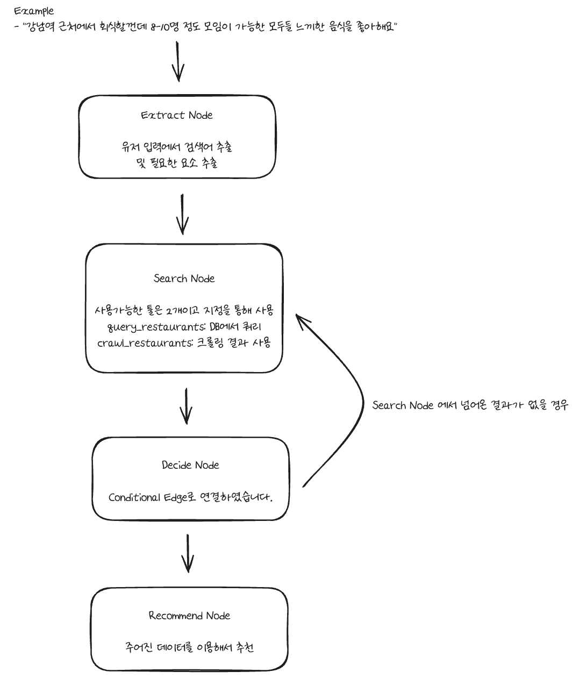
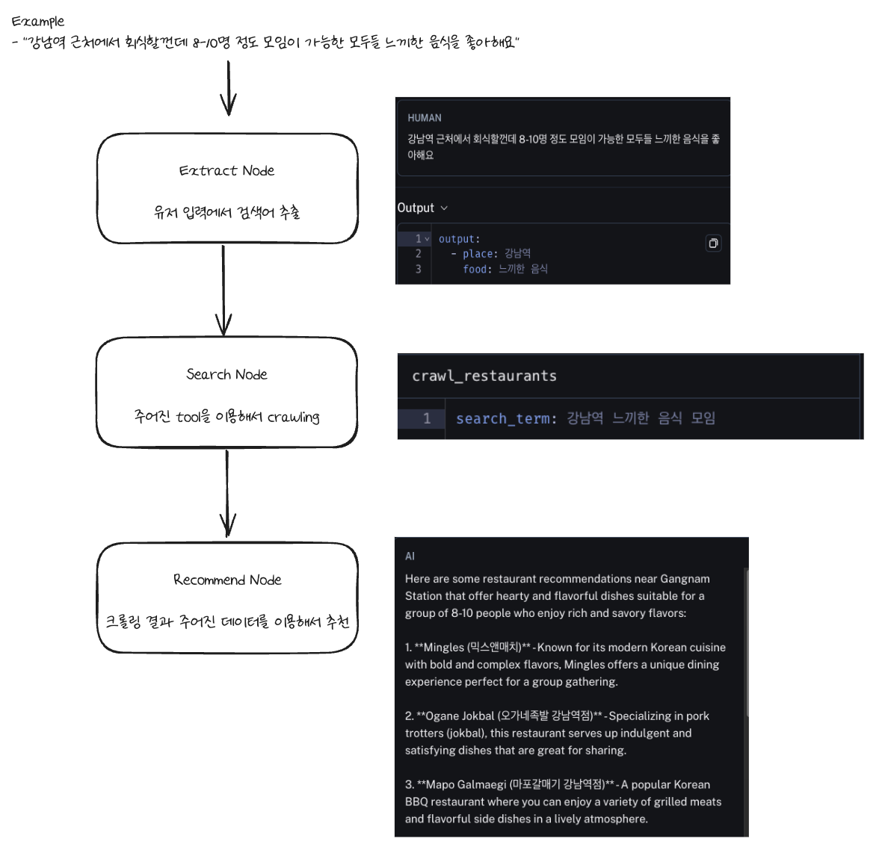
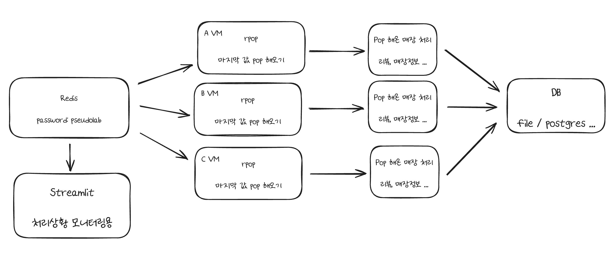

## Langgraph

### 2024-05-15

1. 검색어를 추출합니다.
2. Search Node에서는 처음 시도에서는 query_restaurants 를 이용하여 검색합니다.
3. Decide Node에서는 결과가 없을경우 Search Node로 돌아가 crwal_restaurants 를 이용합니다.
4. 최종적으로 Recommend Node에서 데이터를 바탕으로 유저에게 맛집을 추천합니다.

### 2024-05-01

- `python test.py` 실행으로 input을 통해 검색어를 추출하고 검색을 진행하여 음식점 이름으로만 추천을 진행합니다.

## 크롤링 구조

1. 공용의 Redis 존재
2. 검색어에 따라 레스토랑 목록을 크롤링 해서 Redis에 저장
3. Redis의 데이터를 각자의 VM에서 하나씩 가져와서 처리 후 공용 Storage 혹은 DB에 저장

### 동시성제어 테스트

https://github.com/ehddnr301/crawling_example/assets/54092915/326bcdb0-09d2-47c7-8017-c98ed848a874
